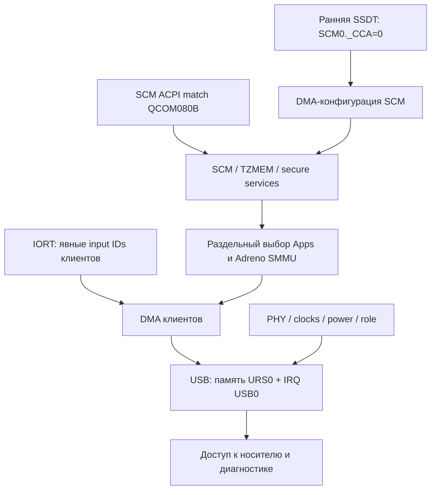

# ACPI: firmware-интерфейсы и требования Linux

Рабочая система использует Device Tree. **Полноценная загрузка через OEM ACPI не подтверждена.** Таблицы прочитаны на оборудовании и сопоставлены с Windows; подготовленные SCM/SMMU изменения проверены полной сборкой, но не аппаратным запуском.

## Идентичность таблиц

| Объект | Подтверждённые данные |
|---|---|
| XSDT | Адрес 0xffffc000; 13 указателей |
| DSDT | 189125 байт; получена через FADT, совпадает с Windows |
| DSDT SHA256 | 78b42f6edc265bffdb3ad1d82c0e63bd98792ab42db9238571f893eeeb06b19f |
| IORT | QCOM / QCOMEDK2, OEM revision 0x7180; два SMMU и 16 NamedComponent |
| IORT SHA256 | aec7a46d8518744956d3776fee085de8ac3f23e6ab44e1ae04611c76261637b9 |
| SSDT | В прочитанной XSDT отсутствуют |
| BGRT | Между Windows и Linux отличается статус изображения и checksum |

[Метод чтения и сохранение диагностики](../research/acpi-audit/memdiag/README.md), [сравнение с Windows](../research/acpi-audit/memdiag/live-logs/comparison.md). Длины и контрольные суммы проверены. MSDM payload исключён из исследования. Совпадение таблиц с Windows подтверждает происхождение описания, а не наличие соответствующих Linux-драйверов.

## Зависимости

Это карта необходимых связей, а не полный порядок всех ACPI devices. Display, EC и остальные подсистемы имеют дополнительные зависимости.

## SCM и DMA

OEM `SCM0` имеет HID QCOM080B, но не содержит _CRS/_CCA; _CCA отсутствует и у проверенных предков. При ACPI_CCA_REQUIRED это приводит к неподдерживаемому DMA для platform device. Исходный SCM также безусловно запрашивает OF interconnect, который без OF-node возвращает ENODEV.

Рабочий DT SCM использует noncoherent DMA, mask/coherent mask 0xffffffff. Аппаратная проба успешно выделила и освободила 4096 байт, проверив CPU pattern; SMC не выполнялся. Это подтверждение DMA-настройки Linux, а не передачи буфера TrustZone.

[SCM v2](../patches/kernel/acpi/scm-acpi-draft-v2.patch) добавляет ACPI match, условный OF interconnect, проверку _CCA, начальную ACPI TZMEM allocation PAGE_SIZE и снятие ACPI dependencies после успешного probe. Используется GENERIC TZMEM. [Детали SCM](../research/acpi-audit/scm/README.md).

_CCA должна присутствовать до создания устройства. [Ранняя SSDT](../research/acpi-audit/scm/early-ssdt/README.md) добавляет только SCM0._CCA=0, не заменяя DSDT. AML и размещение в несжатом CPIO перед основным initramfs проверены ACPICA и настоящим kernel earlycpio parser. На оборудовании таблица пока не испытана.

SCM probe может выполнять secure-world вызовы, включая выбор convention, download mode/SDI и QTEE-инициализацию. Успешная DMA allocation не подтверждает корректность всех этих действий. Задача [19517](https://bugs.etersoft.ru/19517).

## SMMU

| IORT / ресурсы | Требуемая реализация в подготовленном патче |
|---|---|
| SMMUv2, ARM_MMU500, 0x15000000/0x100000 | qcom_smmu_500_impl0_data |
| SMMUv2, GENERIC_SMMU, 0x5040000/0x10000 | qcom_adreno_smmu_v2_impl |

[Патч выбора SMMU](../patches/kernel/acpi/sc7180-acpi-smmu-selection.patch) ограничен OEM revision 0x7180 и проверкой модели/размеров. Проверены object-build ACPI=y/n, host-матрица из двух положительных и шести отрицательных случаев и полная сборка ACPI2. Аппаратный reset/DMA с патчем не проверен.

Политика доменов клиентов и ACTLR содержит отдельные OF-зависимости. Выбор правильной реализации SMMU не решает их автоматически. Потеря изображения из-за generic reset остаётся гипотезой, не установленной причиной. [Анализ клиентов](../research/acpi-audit/smmu/client-policy.md), задача [19515](https://bugs.etersoft.ru/19515).

## IORT: маршрутизация DMA

Все mappings 16 NamedComponent имеют flags=0, без SINGLE_MAPPING. Обычный Linux-путь без входного ID не выбирает начальный SID; альтернативный путь с явным input ID использует диапазоны таблицы.

| Узел IORT | Input ID | Output SID |
|---|---|---|
| URS0 | 0x80030000 | 0x540 |
| Корневой USB0 | 0x80030000 | 0x540 |
| UFS0 | 0x81030000 | 0xa0 |

[Проверка функций IORT](../research/acpi-audit/iort-mappings/README.md) подтвердила первые mappings всех 16 узлов с явным ID. Это host-проверка, не аппаратный DMA-тест. Flags=0 сами по себе не означают нарушение спецификации. Глобальная установка SINGLE_MAPPING не обоснована: есть несколько mappings и диапазоны.

acpi_dma_configure_id продолжает настройку после некоторых ошибок IOMMU; успешный probe не доказывает наличие корректного iommu_fwspec. Задача [19529](https://bugs.etersoft.ru/19529).

## USB

URS0 (QCOM0897 / PNP0CA1) содержит память 0x0a600000 длиной 0x000fffff и _CCA=0. Дочерний `URS0.USB0` содержит IRQ 165,162,518,520,521; первый соответствует DT SPI133 +32. Фактический дочерний путь отличается от корневого USB0 в IORT.

Нужен glue, объединяющий ресурсы, сохраняющий правильный firmware parent для DMA и управляющий PHY/clocks/power/role. Одного добавления HID в match недостаточно. _DEP UCS0 сам по себе не доказывает блокировку enumeration Linux. [Сверка ACPI/DT](../research/acpi-audit/iort-mappings/usb-resources.md), задача [19530](https://bugs.etersoft.ru/19530).

[Основа USB-адаптации](../research/acpi-audit/usb-glue/README.md): исторический upstream ACPI URS glue проверен сборкой на ACPI2 после изменения platform remove API. ACPI-only прототип уже ограничен HID QCOM0897, проверяет ресурсы и SID/domain, использует отдельное имя и DMA-родителя URS0. Передача IORT input ID до probe и аппаратная работа ещё не реализованы/не проверены; это не готовый USB-драйвер TCL.

## Другие пробелы

| Проблема | Факт / ограничение |
|---|---|
| PCI=n | [Условный PCI_CONFIG handler](../patches/kernel/acpi/acpica-default-spaces-without-pci.patch); исправление не делает всю ACPI-загрузку рабочей |
| GPU0.AVS0 | Ссылка есть в TZ7._TZD и IORT, определения в прочитанных таблицах нет; причина чёрного экрана этим не доказана |
| Батарея | Нужны I²C/GenericSerialBus handler и зависимости EC; ошибка отдельного AML-вызова в симуляторе не доказывает ошибку порядка Linux |
| Графика и питание | OEM описание не заменяет Qualcomm/bridge драйверы и их power sequencing |

## Прямые ссылки на изменения ядра

[Каталог ACPI-патчей](../patches/kernel/README.md) и [конфигурация ACPI2](../research/acpi-boot/acpi2/README.md): release 6.18.34-tcl-acpi2, полный Image и 948 согласованных модулей собраны. Объединённый initramfs ещё не подготовлен, аппаратная загрузка этого комплекта не выполнена.

Условие следующего аппаратного теста — работающий канал диагностики, согласованные модули/firmware и ранняя таблица. Наличие Image или shell само по себе не обеспечивает наблюдение результата. Общая задача [19492](https://bugs.etersoft.ru/19492).
