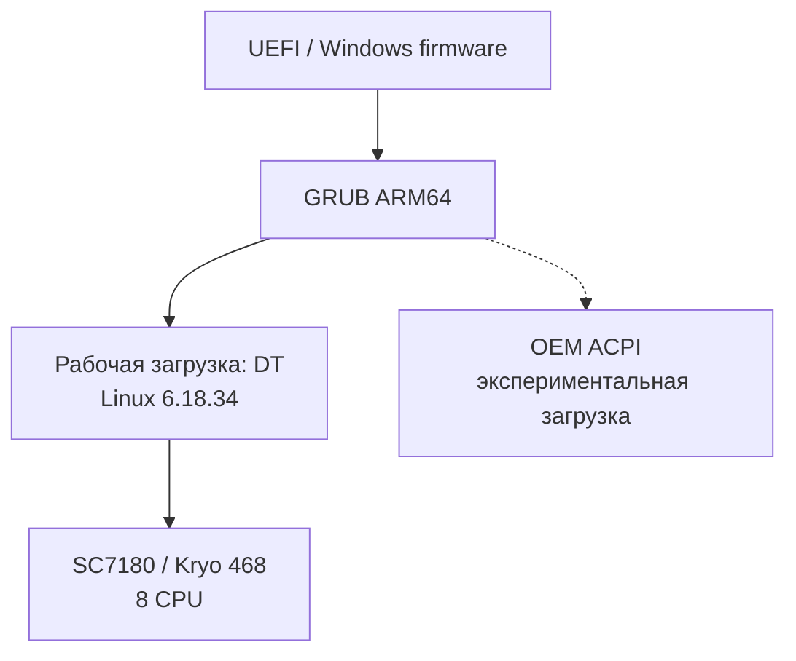
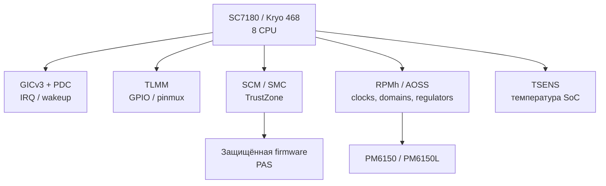
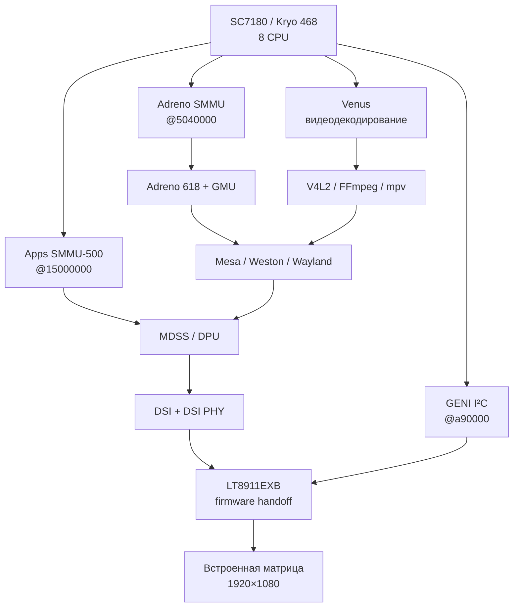
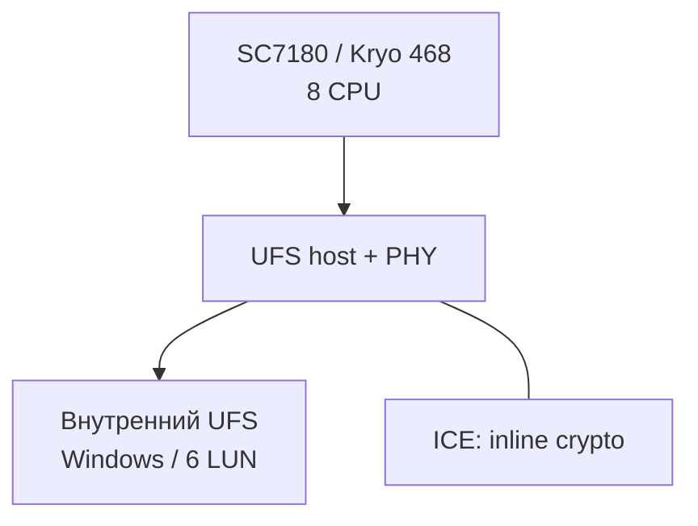
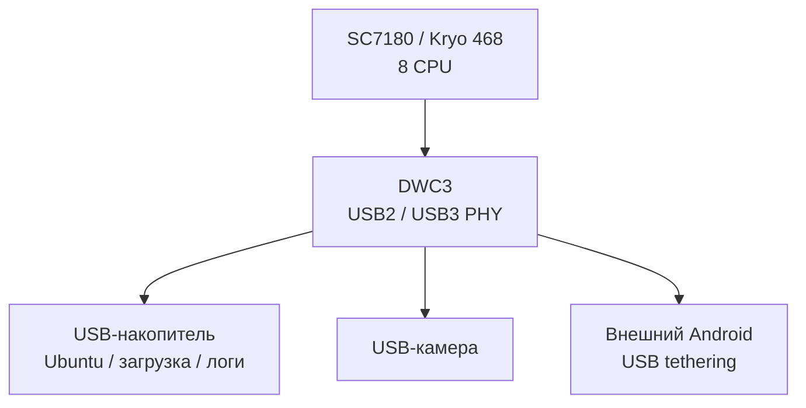
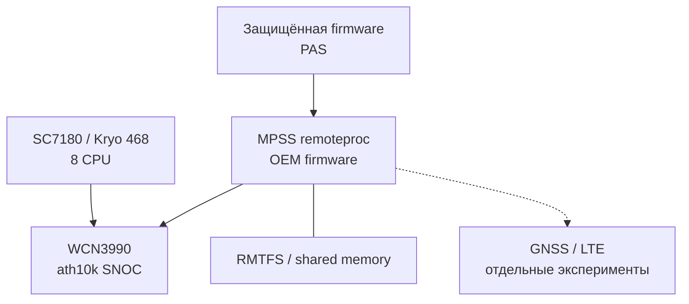
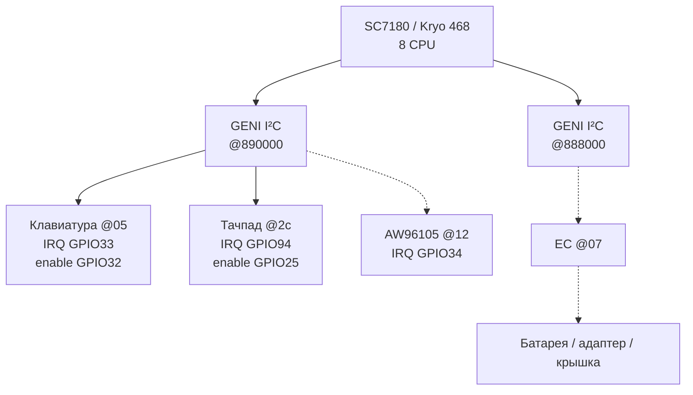
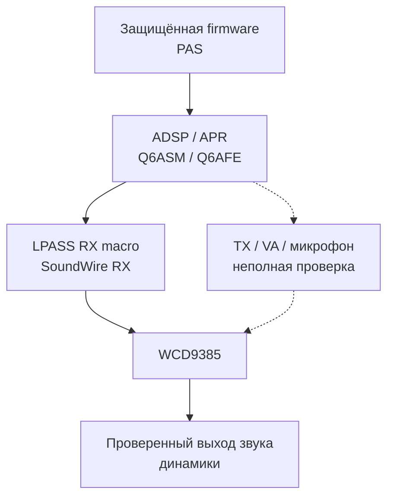

# Функциональная схема

Это схема известных связей, а не электрическая принципиальная схема. Сплошные линии обозначают связь, подтверждённую рабочим DT или предыдущим аппаратным тестом; пунктир — отдельное исследование, данные ACPI/Windows или неполное описание. Питание не показано как точная разводка платы: используйте таблицу регуляторов.

Схема разложена на вертикальные блоки по подсистемам. Повторяющиеся SC7180 и firmware обозначают одни и те же узлы; подробные ресурсы и степень проверки приведены в [спецификациях подсистем](../subsystems.md).

## Загрузка

## Процессор, прерывания и питание

[Ресурсы общей инфраструктуры](platform.md).

## Графика и видео

Полные пути ICC, такты и питание: [DT-дисплей](display.md) и [ACPI-дисплей](display-acpi.md). Физические связи SC7180 одинаковы; способы перечисления устройств и подтверждённая поддержка описаны раздельно.

## Внутренний накопитель

## USB и внешние устройства

## Wi-Fi, модем и GNSS

## Клавиатура, тачпад, датчики и EC

## Звук

SCM не заменяет драйверы периферии. Apps SMMU и Adreno SMMU требуют разных Qualcomm implementation. Связь MPSS с Wi-Fi означает зависимость инициализации/firmware, а не прохождение всего сетевого трафика через модем. Линия звука не утверждает прямое электрическое подключение динамиков к выводам WCD без промежуточного тракта.

Численные параметры: [основная таблица](device-summary.md), [все 738 узлов](full-inventory.md), [живой DTS](live.dts).
