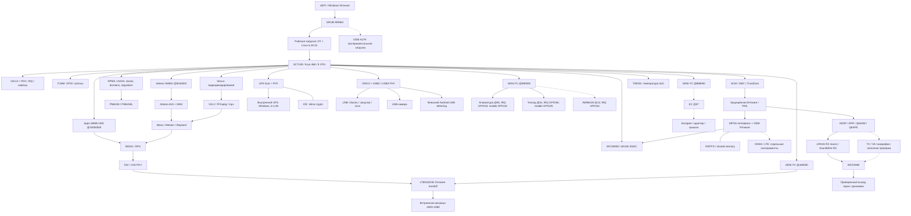

# Функциональная схема

Это схема известных связей, а не электрическая принципиальная схема. Сплошные линии обозначают связь, подтверждённую рабочим DT или предыдущим аппаратным тестом; пунктир — отдельное исследование, данные ACPI/Windows или неполное описание. Питание не показано как точная разводка платы: используйте таблицу регуляторов.

SCM не заменяет драйверы периферии. Apps SMMU и Adreno SMMU требуют разных Qualcomm implementation. Связь MPSS с Wi-Fi означает зависимость инициализации/firmware, а не прохождение всего сетевого трафика через модем. Линия звука не утверждает прямое электрическое подключение динамиков к выводам WCD без промежуточного тракта.

Численные параметры: [основная таблица](device-summary.md), [все 738 узлов](full-inventory.md), [живой DTS](live.dts).
