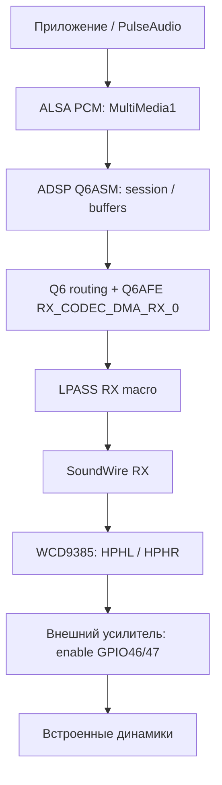

# Звук: ADSP, SoundWire и WCD9385

**Проверено на оборудовании:** WCD9385 идентифицирован прямым чтением регистров; звук из динамиков подтверждён пользователем при воспроизведении тона и фильма. Звук Firefox подтверждён через PulseAudio. Рабочий тракт использует модифицированное ядро `6.18.34-tcl-audio2` и диагностическую ASoC-карту; полная постоянная интеграция питания, маршрутов и автозапуска не завершена.

## Аудиотракт

Проверка слышимого звука подтверждает работу этого тракта в целом. Независимое сопоставление каждого канала отдельному динамику, характеристики усилителя и измерение аналогового сигнала не выполнены.

## Ресурсы и интерфейсы

| Блок | Ресурс / назначение | Основание |
|---|---|---|
| ADSP PAS | MMIO 0x62400000/0x100; firmware `qcom/sc7180/tcl/b220g/qcadsp7180.mbn` | Рабочий DT |
| ADSP memory | 0x90b00000/0x2800000, no-map | Рабочий DT |
| ADSP power | RPMh domains lcx/lmx, IDs 6/5 | Рабочий DT |
| Q6AFE | APR service 4; DAI113 RX_CODEC_DMA_RX_0 | Диагностическая карта |
| Q6ASM | APR service 7; DAI0 MultiMedia1 | Диагностическая карта |
| Q6 routing | APR service 8 | Диагностическая карта |
| RX macro | 0x62600000/0x1000; rx_macro_rx1 DAI0 | DT и работа тракта |
| SoundWire RX | 0x62610000/0x2000; GIC SPI297 rising; SDW Pin0 | DT и работа тракта |
| SoundWire TX | База 0x62630000; транспорт регистров WCD | OEM и прямое чтение кодека |
| VA macro | 0x62770000/0x1000; fsgen 9.6 MHz | Рабочий DT |
| AON clock controller | 0x62780000/0x40000 | Рабочий DT |
| LPI pinctrl | 0x627c0000/0x10000 и 0x62950000/0x10000 | Рабочий DT |
| Codec reset | TLMM GPIO58 | OEM-последовательность и аппаратная проверка |
| Speaker PA enable | TLMM GPIO46/47; high включает проверенный выход | OEM + слышимый тест |

Полные clocks, IRQ и параметры портов RX сохранены в [реестре DT](full-inventory.md). Часть codec/TX/machine-card связей создавалась диагностическими модулями и не представлена как полный постоянный DT ноутбука.

RX macro получает Q6AFE clocks 57/58/102/103, SoundWire RX — clock от RX macro. AON и VA зависят от Q6AFE clock provider. Provider должен иметь правильного родителя APR service 4: обычный platform-parent не предоставляет ожидаемое состояние Q6AFE. Это существенное требование к интеграции DT.

## Идентификация кодека

Прямое чтение через SoundWire TX, без regmap cache:

| Регистр | Значение |
|---|---|
| CHIP_ID0, 0x3401 | 0x00 |
| CHIP_ID1, 0x3402 | 0x00 |
| CHIP_ID2, 0x3403 | 0x0d |
| CHIP_ID3, 0x3404 | 0x01 |
| DIGITAL_EFUSE_REG_0, 0x34b0 | 0x0a |

Поле variant: `(0x0a & 0x1e) >> 1 = 5`, что соответствует WCD9385 в драйвере wcd938x. Это подтверждение конкретного варианта, а не вывод только из имени SoundWire-устройства. [Исходник проверки](../../research/peripherals/camera-audio/audio2/codec-identification/tcl_wcd_id.c).

## Питание и reset

| Ресурс | Подтверждено | Открытый вопрос |
|---|---|---|
| LDO15_A | OEM AUDD, CMD DB 0x42200; запрос 1.8 V использован в тестах | Полная постоянная regulator-интеграция |
| BOB_C | OEM AUDD, CMD DB 0x40400; прямой RPMh request 3.3 V использован в тестах | Представление через штатный Linux selector |
| LDO10_A | CMD DB 0x41d00; OEM таблица содержит запрос 1.8 V | Связь с codec vdd-rxtx/vdd-io не доказана |
| LDO10_C | Wi-Fi regulator, 3.304 V | Это другой PMIC; не подменяет LDO10_A |

Штатный WCD938x требует vdd-rxtx, vdd-io, vdd-buck, vdd-mic-bias и reset GPIO. Наличие питания во время успешного теста не устанавливает физическую разводку всех четырёх supplies. Временный regulator не является готовой реализацией управления питанием.

OEM software запрашивает reset low → 5 ms → high → 2 ms. Это программные интервалы, не измерение фронтов. GPIO58 проверен, однако в исходном boot DT действует reservation 58–62. Изменение DT после регистрации gpiochip само по себе не пересоздаёт valid_mask. Постоянная интеграция должна отдельно учесть GPIO58, сохранив ограничения остальных линий.

Для Linux pmic5_bob шаг selector равен 32 mV от 3 V: 3.300 V точно не представляется, соседние значения 3.288/3.320 V. Автоматическое округление требует доказательства допустимого напряжения; успешный прямой OEM request не задаёт это правило. Фактическое выходное напряжение электрически не измерено.

## Необходимые исправления

| Изменение | Назначение | Степень проверки |
|---|---|---|
| [GLINK backport](../../patches/kernel/audio/0001-glink-destroy-backport.patch) | Исправление GLINK teardown, upstream 5a5a48e788e02 | Включён в AUDIO2 |
| [Q6AFE active mask](../../patches/kernel/audio/0002-q6afe-active-mask.patch) | Передача явной active_channels_mask | Mask3 проходит hw_params; прежняя ошибка AFE не повторилась в проверке |
| [WCD IRQ lifetime](../../patches/kernel/audio/wcd938x-irq-lifetime.patch) | Cleanup IRQ mapping/domain и защита callback при снятой ссылке | Сборка/анализ; полное покрытие гонок и fault injection отсутствует |
| [Q6ASM repeated prepare](../../patches/kernel/audio/q6asm-prepare-stopped.patch) | Cleanup существующей session и после STOPPED | На чистой загрузке три write/drop/prepare цикла на одном PCM handle прошли |

WCD IRQ patch меняет aggregate и SoundWire codec совместно: NULL guard и синхронизация ссылки необходимы вместе с cleanup. Временный [runtime path fallback](../../patches/kernel/audio/runtime-path-fallback.patch) для поиска overlay-узлов — отдельное диагностическое изменение.

Q6ASM STOP отправляет EOS без CLOSE; прежняя проверка состояния пропускала cleanup при повторном prepare после STOPPED. Проверенный переход не покрывает все error paths, асинхронный EOS, capture и compress. Полной проверенной серии для чистого upstream-ядра пока нет.

## Воспроизведение, уровни и приложения

Проверен PCM 48 kHz, S16_LE, stereo. Диагностическая карта соединяет MultiMedia1 с RX backend, WCD RX, SoundWire и RX macro; [исходник карты](../../research/peripherals/camera-audio/audio2/card-live/tcl_audio_card.c).

Для слышимого выхода нужны HPHL/HPHR/CLSH switches, RX/WCD DAPM-маршруты и включение PA. Состояние PCM RUNNING само по себе не доказывает аналоговый звук. Усилитель в проверенном сценарии включается после запуска PCM и выключается при cleanup.

Громкость приложения, RX digital gain и HPH analog gain — разные уровни. Фильм проверялся, в частности, при mpv 50% и HPH/RX 0 dB; это условия конкретного теста, не калиброванный уровень звукового давления или универсальная настройка громкости. Щелчок при закрытии и устойчивость всех повторных запусков ещё требуют проверки.

Фильм с программным декодированием и GPU-выводом через PulseAudio также подтверждён пользователем как работающий отлично. Это проверка воспроизведения после подготовки аудиотракта, не подтверждение исправности автоматического старта после загрузки.

Firefox выдавал звук через PulseAudio 17. Этот результат не подтверждает постоянную загрузочную интеграцию: использовались временный аудиотракт и ограниченный по времени сценарий.

## Микрофон и завершение интеграции

ALSA capture-устройство появляется из-за двунаправленного Q6ASM frontend. В проверенной machine card нет TX capture backend. Рабочая запись, физическая разводка аналоговых микрофонов/DMIC и назначение входов не подтверждены.

Для постоянной поддержки нужны полная DT/ASoC-карта, штатное владение GPIO и regulators, PA sequencing через DAPM, проверка каналов и уровней, runtime PM, suspend/resume и повторное воспроизведение. Подтверждённый слышимый звук не закрывает эти требования.
