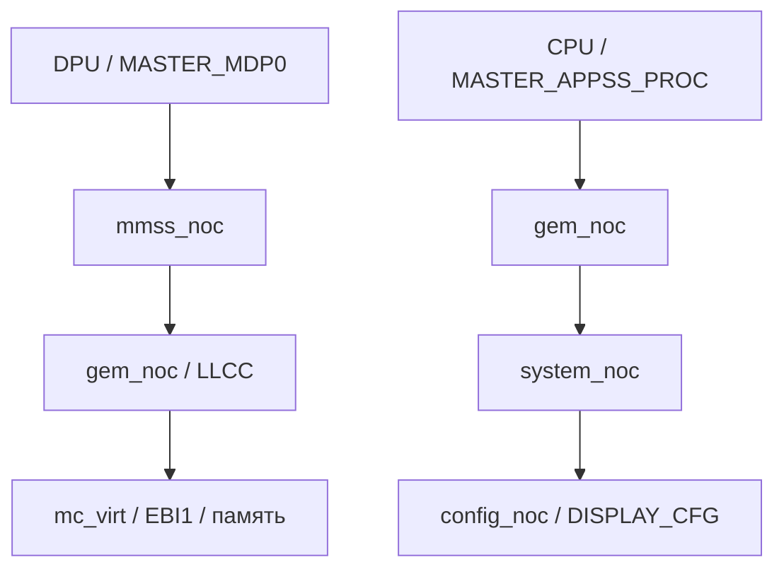

# Дисплей через ACPI: ресурсы и зависимости Linux

**Текущее подтверждение:** Ubuntu 26.04.1 LTS и ALT Linux на ACPI с ядром `7.2.4-tcl-acpi-display1+`, нативный framebuffer `msm-kmsdrmfb`, Weston/Wayland и Adreno. Исходники включены в [ACPI-серию](../../patches/kernel/acpi/README.md). Аппаратное декодирование видео оценивается отдельно от GPU-вывода.

Полноэкранный OpenGL-тест `glmark2-wayland` на ALT Linux определил freedreno FD618, OpenGL 4.6 и завершился со скоростью 363 FPS и итоговым score 362 при 1920×1080. Ошибок GPU в журнале ядра и перезапуска Weston во время этого теста не было.

Полный журнал загрузки выявил две ошибки порядка и владения ресурсами. SID
`0x800` получал SMMU fault, потому что DPU platform device подключался к новому
IOMMU domain до остановки firmware scanout. Теперь координатор останавливает и
проверяет DPU DMA до создания устройства. Firmware также оставляла физически
включёнными DSI byte, byte-interface и pixel branches без соответствующих CCF
enable counts. При первом изменении общего VCO это вызывало
`disp_cc_mdss_pclk0_clk_src: rcg didn't update its configuration`. Координатор
принимает каждую ветвь сбалансированной парой CCF enable/disable до настройки
частот. Проверенная загрузка завершилась без обоих сообщений, с нативным DRM и
подключённым eDP.

Turnip определяет Adreno 618 и Vulkan 1.3.354, но Wayland swapchain пока не работает: передаётся неподдержанный KMS-формат `XB4H` с modifier `0x500000000000001`. Weston при этой ошибке попадает в assertion выбора overlay plane и перезапускается. Поэтому Vulkan device/driver подтверждены, а Vulkan WSI/scanout — ещё нет.

## Вывод изображения

Требуемая цепочка: буферы изображения → DPU → DSI host → 10 nm DSI PHY → LT8911EXB → eDP-панель 1920×1080. Работа этой цепочки подтверждена в DT и ACPI; полнота управления питанием и повторный запуск требуют отдельной проверки. Мост пока опирается на настройку UEFI; cold-start Linux не подтверждён и в DT.

| Блок | Ресурс | Требование при ACPI-перечислении |
|---|---|---|
| GPU0 | OEM HID QCOM083A; общий display MMIO 0xae00000/0x151000 | Разделить ресурсы потребителей; совпадение общего родителя не заменяет clock/power/graph links |
| MDSS | 0xae00000/0x1000; GSI115 = GIC SPI83, level-high | Создать родительский домен IRQ |
| DPU mdp / vbif | 0xae01000/0x8f000; 0xaeb0000/0x3000 | MDSS IRQ0; clock, OPP, ICC и DMA зависимости |
| DSI host | 0xae94000/0x400 | MDSS IRQ4; PHY и DRM bridge links |
| PHY / lanes / PLL | 0xae94400/0x200; 0xae94600/0x280; 0xae94a00/0x1e0 | Именованные окна; доступ к PLL после включения домена MDSS и iface |
| DISPCC | Подокно 0xaf00000/0x20000 | Проверять включение окна в GPU0._CRS; это ограниченное окно адаптации, не копия размера DT-региона |
| GCC | 0x100000/0x1f0000 | Дополнительный ресурс SC7180 из описания SoC; отсутствует в GPU0._CRS |
| Мост | LT8911EXB, I²C10 @0x29; GENI 0xa90000/0x4000, SPI357 | Отдельно обеспечить I²C/bridge и UEFI handoff |

Источник OEM-ресурсов — [ACPI-аудит](../acpi.md); назначение подблоков и соединений — рабочий [DT-инвентарь](full-inventory.md). Адреса из DT/SoC не следует выдавать за свойства OEM ACPI. TREE/QCOM0876 описывает зарезервированную RAM 0x9e400000/0x1400000 и не является GCC.

## Пути к памяти и регистрам

`mdp0-mem` — путь чтения буферов изображения DPU из памяти. `cpu-cfg` — путь доступа CPU к регистрам дисплея. Это разные назначения; ни один из них не является линией DSI/eDP до панели. IOMMU отдельно задаёт трансляцию адресов DMA и не заменяет ICC-маршрут или запрос пропускной способности.

| Имя пути | Начальная точка | Конечная точка | Тег DT-эталона |
|---|---|---|---|
| `mdp0-mem` | mmss_noc / MASTER_MDP0 (4) | mc_virt / SLAVE_EBI1 (1) | QCOM_ICC_TAG_ALWAYS (7) |
| `cpu-cfg` | gem_noc / MASTER_APPSS_PROC (0) | config_noc / SLAVE_DISPLAY_CFG (18) | QCOM_ICC_TAG_ALWAYS (7) |

DT задаёт эти endpoints. Промежуточные узлы находятся в таблице SC7180 драйвера ICC. [Сопоставление исходников 6.18 и 7.2.4](../../research/display-interconnect/README.md) подтверждает одинаковые переходы в обеих версиях.

| Путь | Последовательность узлов и контроллеров |
|---|---|
| `mdp0-mem` | **mmss_noc:** qxm_mdp0 → qns_mem_noc_hf; **gem_noc:** qnm_mnoc_hf → qns_llcc; **mc_virt:** llcc_mc → ebi |
| `cpu-cfg` | **gem_noc:** acm_apps0 → qns_gem_noc_snoc; **system_noc:** qnm_gemnoc → qns_cnoc; **config_noc:** qnm_snoc → qhs_display_cfg |

Для двух путей требуются пять контроллеров: **mmss_noc, gem_noc, mc_virt, system_noc, config_noc**. `system_noc` — обязательный промежуточный переход к регистрам, хотя его нет среди четырёх endpoints в свойстве MDSS `interconnects`.

Диаграмма показывает направления запросов, а не физическую трассировку проводников. Два блока gem_noc обозначают один контроллер. Полная регистрация ICC требует также BCM voter, command DB и корректной обработки общих зависимостей; список пяти контроллеров описывает пути, а не исчерпывающий порядок их probe.

## Такты, питание и частоты

Значения ниже взяты из [сохранённого рабочего DT и расшифровки свойств](properties.json). Имена после стрелки — clock IDs поставщика; числа — значения этих IDs, не частоты.

| Потребитель | Имя такта → поставщик / ID |
|---|---|
| MDSS | iface → GCC/GCC_DISP_AHB_CLK (23); ahb → DISPCC/DISP_CC_MDSS_AHB_CLK (2); core → DISPCC/DISP_CC_MDSS_MDP_CLK (20) |
| DPU | bus → GCC/GCC_DISP_HF_AXI_CLK (26); iface → DISPCC/AHB (2); rot → DISPCC/ROT (26); lut → DISPCC/MDP_LUT (22); core → DISPCC/MDP (20); vsync → DISPCC/VSYNC (30) |
| DSI host | byte → DISPCC/BYTE0 (4); byte_intf → DISPCC/BYTE0_INTF (7); pixel → DISPCC/PCLK0 (24); core → DISPCC/ESC0 (18); iface → DISPCC/AHB (2); bus → GCC/DISP_HF_AXI (26) |
| DSI PHY | iface → DISPCC/AHB (2); ref → RPMhCC/RPMH_CXO_CLK (0), 19,2 МГц |

Для кратких DISPCC-имён в таблице полная форма — `DISP_CC_MDSS_<имя>_CLK`; для GCC — `GCC_DISP_HF_AXI_CLK`. Частоты VSYNC, ROT и AHB назначены DT равными 19,2 МГц. Источники BYTE0_CLK_SRC (5) и PCLK0_CLK_SRC (25) выбирают выходы PHY DSI_BYTE_PLL_CLK (0) и DSI_PIXEL_PLL_CLK (1). PHY использует iface от DISPCC и сам поставляет ему PLL-такты; регистрация должна учитывать эту взаимную зависимость.

| Узел | Домен / питание |
|---|---|
| GCC | RPMh CX |
| MDSS | DISPCC MDSS_GDSC (0) |
| DPU | RPMh CX (0), частота связана с OPP |
| DSI host | RPMh CX (0); vdda = PM6150L L3c, 1,2 В |
| DSI PHY | vdds = PM6150 L4a, 0,88 В; в DT — дочернее устройство MDSS, без собственного свойства power-domains |

Напряжения — ограничения рабочей конфигурации, а не измеренные значения на плате. Для PHY существенна также зависимость runtime PM от родителя MDSS: одних clk/regulator links недостаточно для воспроизведения этой связи при другом способе перечисления устройств.

| Частота MDP core | Уровень CX | Числовое значение RPMh |
|---|---|---|
| 200 МГц | LOW_SVS | 64 |
| 300 МГц | SVS | 128 |
| 345 МГц | SVS_L1 | 192 |
| 460 МГц | NOM | 256 |

Это OPP для MDP, не частоты DSI pixel clock и не частота обновления панели. Числа RPMh — абстрактные уровни производительности, **не милливольты**; соответствие аппаратным уровням получает RPMhPD из command DB. Работа DT-дисплея не означает, что отдельно испытаны все OPP и переходы между ними.

## Что необходимо воспроизвести в ACPI

| Зависимость | Требуемая реализация | Степень подтверждения ACPI |
|---|---|---|
| GCC → DISPCC → PHY | Явные clock aliases, поставщики и последовательность probe; late PLL parents PHY; CCF handoff включённых firmware branches | Нативный вывод и первый PCLK update работают без WARNING |
| Питание PHY | MDSS_GDSC должен быть доступен до чтения PLL; GPU0 не заменяет runtime-PM родителя MDSS | Начальный запуск подтверждён, dynamic idle/suspend не проверены |
| DPU/DSI OPP | Согласовывать частоту с CX до включения потребителя | Начальный режим работает; динамические переходы не подтверждены |
| ICC | Зарегистрировать таблицы пяти контроллеров, BCM voter и получить оба пути с корректными тегами | Оба пути получены, boot bandwidth floor пока удерживается |
| IORT | Выбирать входные IDs нужного DMA-движка, а не все mappings GPU0 | Display DMA и Adreno работают; suspend/rebind не проверены |
| DSI/bridge graph | Связать DPU, DSI, PHY и LT8911EXB, сохранив требования handoff | Работает через firmware bridge handoff; cold start/recovery не подтверждены |

OEM IORT для MDP содержит input IDs 0x30000 → Apps SID0x800, 0x30001 → SID0x802, 0xa0000 → SID0x801. Это сведения таблицы; они не означают успешную настройку display DMA в Linux. Не смешивать эти IDs с идентификаторами ICC endpoints. [Исходные mappings](../../research/acpi-audit/iort-mappings/mappings.json).

В проверенной диагностической ACPI-базе RPMhPD не завершает sync_state для non-OF потребителей. При обработке запросов исходный aggregate-код удерживает максимальный уровень до синхронизации. Это временная политика начального запуска, а не полноценное управление питанием. `off`/performance 0 в generic-domain debugfs не доказывает физического выключения CX. Снимать это ограничение можно после описания зависимостей всех активных потребителей.

Известная топология SC7180 общая для способов загрузки. Спецификация ACPI фиксирует, как Linux должен получить эти связи и что уже проверено; наличие требуемой связи в этой таблице не является заявлением об успешной реализации.
