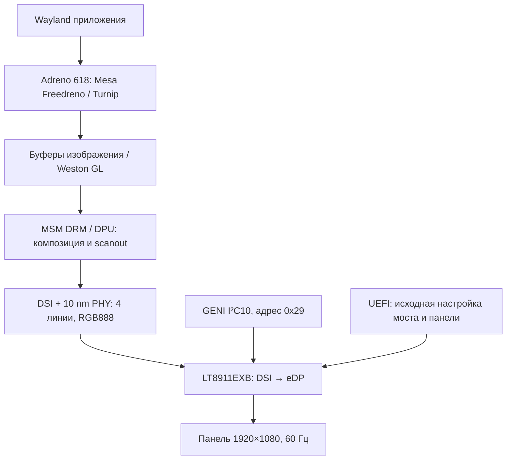

# Экран и графика: DPU, DSI, LT8911EXB и Adreno 618

**Проверено на оборудовании:** нативная консоль `msmdrmfb`, Wayland/Weston с аппаратным GL, OpenGL и Vulkan на Adreno 618. Загрузка использует DT и модифицированное ядро Linux 6.18.34. Полная независимая инициализация дисплейного моста Linux пока не реализована.

## Функциональная схема

Графический рендеринг, scanout и аппаратное декодирование видео — отдельные функции. Venus описан в [материалах видеодекодирования](../../research/peripherals/video-decode/README.md); наличие Adreno не подтверждает выбор аппаратного декодера приложением.

## Режим панели

| Параметр | Значение |
|---|---|
| Активная область | 1920 × 1080 |
| Pixel clock | 142520 kHz |
| Горизонталь: display / sync start / sync end / total | 1920 / 1978 / 2020 / 2080 |
| Вертикаль: display / sync start / sync end / total | 1080 / 1083 / 1088 / 1142 |
| Полярность | +HSync, +VSync |
| Расчётная частота | 142520000 / (2080 × 1142) = 59.9993 Hz |
| DSI | 4 линии, RGB888, video non-burst sync event |

Тайминги взяты из сохранённого EDID и используются handoff-драйвером. Счётчик vsync при анимации дал около 60.1 Hz с погрешностью времени опроса; underrun counter в этой проверке равен нулю. Рендеринг сотен кадров в секунду не увеличивает частоту панели.

## Ресурсы вывода

Источник — [полный DT](full-inventory.md). IRQ внутри MDSS — номера его домена, не GIC SPI.

| Блок | MMIO: адрес / размер | IRQ / IOMMU |
|---|---|---|
| MDSS | 0xae00000 / 0x1000 | GIC SPI83 level-high; Apps SMMU specifier 0x800,0x2 |
| DPU mdp / vbif | 0xae01000 / 0x8f000; 0xaeb0000 / 0x3000 | MDSS IRQ0 |
| DSI host | 0xae94000 / 0x400 | MDSS IRQ4 |
| DSI PHY / lanes / PLL | 0xae94400 / 0x200; 0xae94600 / 0x280; 0xae94a00 / 0x1e0 | — |
| I²C10 | 0xa90000 / 0x4000 | GIC SPI357 level-high |
| LT8911EXB | I²C10 address 0x29 | Отдельный IRQ не описан в handoff-узле |

I²C10: 100 kHz, pinctrl `qup14`, GPIO86/87. DSI vdda — regulators-1/ldo3, 1200000 µV; PHY vdds — regulators-0/ldo4, 880000 µV. Это DT constraints, не измерения. Тактирование DPU/DSI обеспечивают DISPCC `0xaf00000`, GCC и DSI PHY; полные clock IDs, OPP, interconnect и power domains сохранены в реестре.

Для моста и панели ещё нет полного описания reset, регуляторов и подсветки, достаточного для cold-start. Отсутствие этих связей в тестовом DT не означает отсутствие физических цепей.

## Handoff-драйвер LT8911EXB

[Исходник](../../research/peripherals/wayland-probe/native-display/handoff/tcl_lt8911_handoff.c) использует экспериментальный compatible `tcl,b220g-lt8911exb-handoff-test`. Проверяет ID `17:05:E0` и ожидаемые timing registers; единственные I²C writes — выбор банка через 0xff с возвратом в банк 0x81. Не программирует PLL, link training, reset, питание и тайминги заново.

DRM bridge регистрируется перед DSI attach; используется NO_CONNECTOR. Разрешён один режим. Сообщение connected от connector без detect callback не является самостоятельным измерением eDP link.

**Аппаратно подтверждено:** MSM/DPU передаёт изображение через этот мост. **Не подтверждено:** cold-start без UEFI-настройки, полный DPMS, suspend/resume и управление подсветкой. MSM при modeset меняет состояние DSI/PHY, поэтому неизменность регистров самого моста не означает неизменность всей цепочки.

## GPU и firmware

| Блок | Ресурсы DT |
|---|---|
| Adreno 618 | 0x5000000/0x40000, 0x509e000/0x1000, 0x5061000/0x800; GIC SPI300 level-high |
| GMU | 0x506a000/0x31000, 0xb290000/0x10000, 0xb490000/0x10000; SPI304/305 level-high |
| GPU SMMU | 0x5040000/0x10000; GPU SID0, GMU SID5 |
| GPU power/clock | GPUCC 0x5090000; GMU domains cx/gx; speed_bin из QFPROM |
| Firmware | qcom/a630_sqe.fw, qcom/a630_gmu.bin; OEM TCL qcom/sc7180/tcl/qcdxkmsuc7180.mbn |
| OEM reserved memory | 0x80840000 / 0x2000; загрузочный сегмент OEM ELF занимает 4096 байт по MDT loader |

Firmware должны быть доступны на том этапе, когда запускается DRM: в initramfs при раннем KMS, а также в rootfs при последующей загрузке компонентов. OEM бинарник не включён в публичные исходники.

Проверенный стек: Mesa 26.0.8, Weston 14.0.2, renderer GL. GL_VENDOR `freedreno`, GL_RENDERER `FD618`, OpenGL ES 3.2; glmark2 сообщил OpenGL 4.6 Compatibility. Vulkan: Turnip Adreno 618, integrated GPU, vendor 0x5143, device 0x6010800, API 1.3.335. Это версии и возможности проверенного стека, не обещание для любой сборки Mesa.

## Ранний вывод и проверка 3D

Загрузка MSM и handoff-модуля из initramfs до поиска rootfs обеспечила раннюю нативную консоль: в проверенном журнале MSM инициализирован около 1.51 s, msmdrmfb — 1.57 s. Пользователь подтвердил исчезновение длительного чёрного экрана. Это не гарантирует отсутствие переходного гашения во всех конфигурациях.

Wayland vkcube завершился успешно на Turnip. Полный glmark2 из 33 сцен в 1920×1080 с аннотацией завершился; один результат — score381. Короткая сцена 800×600 со score3168 не сопоставима с ним. [Условия измерения](../../research/peripherals/wayland-probe/native-display/kms1-gpu/full-benchmark/README.md).

Для самопроверки в сессии Wayland применимы `glmark2-wayland --fullscreen --annotate` и `vkcube --wsi wayland`. В выводе нужен FD618/Turnip Adreno 618; llvmpipe означает CPU rendering. Окружение Wayland должно относиться к действующей сессии пользователя.

## Исправления и ограничения

[DPU assignment diagnostic patch](../../patches/kernel/graphics/dpu-assignment-diagnostic.patch) добавляет fallback на назначенный CRTC при неудаче legacy lookup. На оборудовании fallback действительно сработал, полный 33-сценный тест завершился. Это локальное диагностическое исправление; точное чередование writer/callback не установлено, upstream review не выполнен.

В другом полном запуске получен score347 при отличавшихся частотах CPU/GPU. Сравнение этих двух результатов не доказывает регрессию или её отсутствие. В тестах сохранялись сообщения dummy vdd/vddcx и sync_state pending GMU; полное управление питанием и длительная устойчивость ещё не подтверждены.
