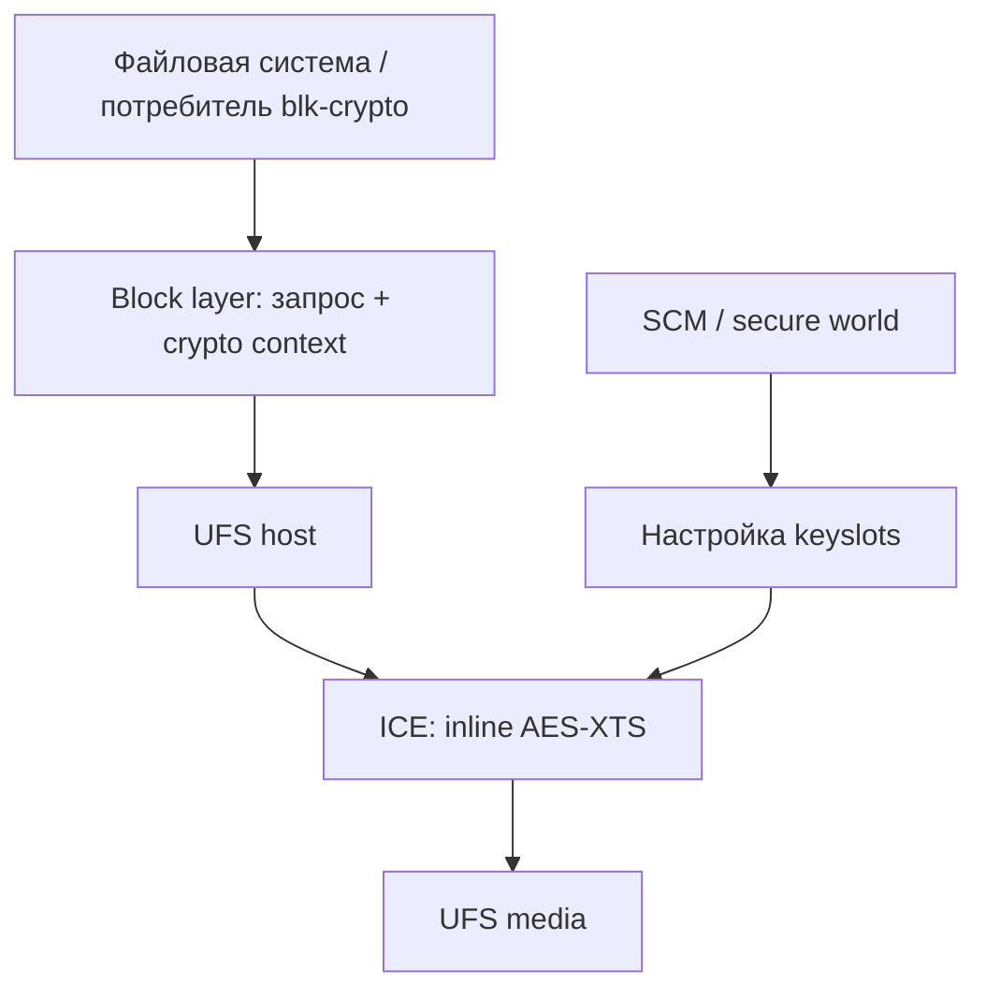

# Внутренний накопитель: UFS и Inline Crypto Engine

В TCL B220G установлен **Samsung KM8F9001JM-B813**, revision `0700`. Linux представляет шесть логических устройств UFS через SCSI как `/dev/sd*`. Это LUN одного накопителя; интерфейс MMC здесь не используется. Буквы устройств не являются постоянными идентификаторами.

**Проверено на оборудовании:** инициализация UFS, чтение GPT всех шести LUN, полное чтение каждого LUN при архивировании и проверка извлечённого содержимого по SHA256. ICE прошёл отдельную проверку инициализации и возможностей. Зашифрованное I/O, запись и восстановление накопителя не испытаны.

## Логические устройства

| UFS LUN | Размер, байт | Число GPT-разделов |
|---|---:|---:|
| 0 | 251331084288 | 4 |
| 1 | 8388608 | 2 |
| 2 | 8388608 | 2 |
| 3 | 134217728 | 2 |
| 4 | 4294967296 | 35 |
| 5 | 134217728 | 4 |

Логический сектор — **4096 байт**. Значение `/sys/block/<device>/size` выражено в 512-байтных единицах. Идентификация должна учитывать путь контроллера `1d84000.ufshc`, LUN, модель и размер.

CRC32 основных GPT headers и partition-entry arrays проверены; первые 128 KiB каждого LUN совпали с данными, снятыми из Windows. Это подтверждает интерпретацию таблиц, но не работоспособность каждой файловой системы. RPMB и области, не предоставленные Linux как эти шесть устройств, не входят в проверенный архив.

## Контроллер и PHY

Источник — [рабочий DT](full-inventory.md). Числовые ID clocks/resets относятся к соответствующим providers этого DT.

| Объект | Ресурс | Значение |
|---|---|---|
| UFS host | compatible | `qcom,sc7180-ufshc`, `qcom,ufshc`, `jedec,ufs-2.0` |
| UFS host | MMIO | `0x1d84000`, размер `0x3000` |
| UFS host | IRQ | GIC SPI 265, level-high; INTID 297 |
| UFS host | IOMMU | Apps SMMU `0x15000000`, specifier `0xa0, 0x0` |
| UFS host | Lanes | 1 на направление |
| UFS host | Power domain / reset | GCC domain 0; GCC reset 2 (`rst`) |
| UFS PHY | compatible | `qcom,sc7180-qmp-ufs-phy` |
| UFS PHY | MMIO | `0x1d87000`, размер `0x1000` |
| UFS PHY | Power domain / reset | GCC domain 0; reset 0 от UFS host (`ufsphy`) |
| ICE | compatible | `qcom,sc7180-inline-crypto-engine`, `qcom,inline-crypto-engine` |
| ICE | MMIO / clock | `0x1d90000`, размер `0x8000`; GCC clock 101 |

Драйверы: `ufshcd-qcom`, `qcom-qmp-ufs-phy`, `qcom-ice`. Host ссылается на PHY через `phys` и на ICE через `qcom,ice`. Обычное UFS I/O проверено также без ICE.

### Тактирование и interconnect

GCC расположен по `0x100000`; RPMh clock controller — под `rsc@18200000`.

| Потребитель / clock-name | Provider / ID |
|---|---|
| Host core_clk | GCC 99 |
| Host bus_aggr_clk | GCC 7 |
| Host iface_clk | GCC 98 |
| Host core_clk_unipro | GCC 107 |
| Host ref_clk | RPMh 0 |
| Host tx_lane0_sync_clk | GCC 106 |
| Host rx_lane0_sync_clk | GCC 105 |
| PHY ref | RPMh 0 |
| PHY ref_aux | GCC 103 |
| PHY qref | GCC 97 |

В `freq-table-hz` host заданы core_clk 50–200 MHz и core_clk_unipro 37.5–150 MHz; остальные пары равны нулю. Это границы конфигурации, не измеренные частоты.

Два interconnect-пути: `ufs-ddr` от provider `0x16e0000` (5,7) к `0x1638000` (1,7); `cpu-ufs` от `0x9680000` (0,7) к `0x1500000` (47,7). Полные исходные ячейки приведены в реестре DT.

### Питание

Пути ниже относительны к `/soc@0/rsc@18200000/`. Напряжения — min=max в DT, не измерения на плате.

| Потребитель / supply | Регулятор | Напряжение |
|---|---|---:|
| UFS vcc | regulators-0/ldo19 | 2960000 µV |
| UFS vccq2 | regulators-0/ldo12 | 1800000 µV |
| PHY vdda-phy | regulators-0/ldo4 | 880000 µV |
| PHY vdda-pll | regulators-1/ldo3 | 1200000 µV |

У всех четырёх регуляторов `regulator-initial-mode=3`. Разводка обоснована OEM PEP и описанием SC7180, работа с этой конфигурацией подтверждена; физическая схема электрически не измерена. Дополнительный reset GPIO не установлен. Токи из DTS других плат не считаются характеристиками TCL.

## ICE: подтверждённые возможности

Проверка на ядре `6.18.34-tcl-ice1`:

| Параметр | Результат |
|---|---|
| Аппаратная версия | ICE v3.1.75 |
| Привязка драйвера | qcom-ice |
| Keyslots | 32, сообщаются для каждого UFS LUN |
| max_dun_bits | 64 |
| Raw keys | supported |
| AES-256-XTS | маска `0x1fe00` в queue/crypto/modes |
| HWKM / wrapped keys | Поддерживаемый HWKM не обнаружен, только raw keys |
| Зашифрованное I/O | Не проверено |

Наличие 32 keyslots у каждого LUN не означает 192 независимых физических слота: устройства используют общий контроллер. Все внутренние LUN при проверке были read-only. Программирование тестовых ключей не запрашивалось.

По реализации Linux 6.18.34 драйвер ICE зависит от SCM, проверяет доступность secure services и включает clock. Raw AES-256-XTS keys настраиваются через SCM. В этом пути нет `request_firmware`: отдельный файл firmware для самого ICE не требуется драйвером. Это не отменяет зависимость от secure-world firmware.

## Применимость шифрования

| Задача | Статус для изученной конфигурации |
|---|---|
| Обычное чтение UFS | Работает с ICE и без него |
| Inline encryption | Нужны BLK_INLINE_ENCRYPTION, SCSI_UFS_CRYPTO, QCOM_INLINE_CRYPTO_ENGINE и связь DT |
| fscrypt + inlinecrypt | Требуются FS_ENCRYPTION, FS_ENCRYPTION_INLINE_CRYPT и поддерживаемая filesystem; зашифрованный путь на TCL не проверен |
| LUKS / dm-crypt | Изученный dm-crypt использует crypto_skcipher, а ICE предоставляет blk-crypto keyslots; автоматическое ускорение не подтверждается этой реализацией |
| Корень Ubuntu на USB/Btrfs loop | Не использует UFS ICE |
| BitLocker | Наличие ICE не раскрывает ключи и не расшифровывает существующий Windows-раздел |
| TLS / OpenSSH / VPN | ICE не является универсальным ускорителем буферов Crypto API |
| Сброс / suspend и ключи | Восстановление ключей после этих переходов не проверено |

В ICE1 FS_ENCRYPTION отключён; [конфигурация](../../research/peripherals/ice-research/ice1/kernel.config). Fscrypt на ext4/F2FS не является готовой заменой полному шифрованию корневого тома: охват содержимого, имён и метаданных отличается. Совместимость последующих ядер определяется их реализацией, а не только наличием CONFIG_DM_CRYPT.

## Целостность и резервная копия

Полные образы шести LUN проверены обратным чтением и SHA256, проверка репозитория Borg также завершена. Реальное восстановление с последующей загрузкой Windows не испытано. Копии содержат индивидуальные данные и не входят в публичный комплект.

Известное ограничение проверки ICE: хеш первого MiB LUN4 изменился между загрузками. Сравнение с более ранним архивом локализовало четыре байта внутри `limits` (смещения LUN `0x80008`, `0x80009`, `0x8000e`, `0x80010`). Остальная сравниваемая область и GPT совпали. Непосредственно перед загрузкой сохранён только хеш, поэтому это не побайтовое сравнение до/после. Причина и момент изменения не установлены; приписывать его ICE или firmware оснований недостаточно.

Read-only в Linux — состояние block device данной загрузки. Оно не описывает действия firmware до запуска Linux. Контроль архивов не заменяет испытание восстановления и не доказывает отсутствие последующих изменений накопителя.
