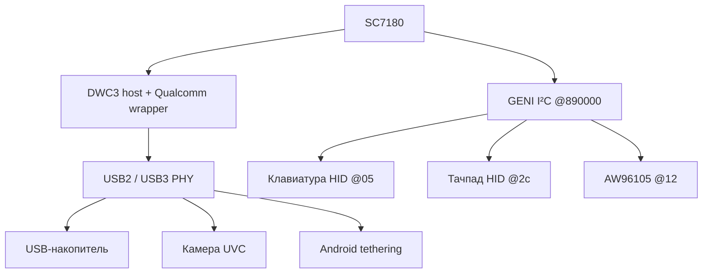

# USB, клавиатура и тачпад

**Проверено при DT-загрузке:** USB-накопитель с Ubuntu rootfs, USB tethering Android и UVC-камера. Ввод клавиатуры подтверждён пользователем; клавиатура и тачпад зарегистрированы драйвером I²C HID. Полный набор жестов, wakeup и suspend/resume не проверен.

## Связи устройств

Схема показывает функциональные зависимости, а не точную разводку физических разъёмов и внутренних USB hub. Число разъёмов и их индивидуальные возможности этим DT не устанавливаются.

## USB host

| Ресурс | Значение DT |
|---|---|
| Qualcomm wrapper | 0xa6f8800 / 0x400; compatible qcom,sc7180-dwc3, qcom,dwc3 |
| DWC3 core | 0xa600000 / 0xe000; compatible snps,dwc3 |
| Core IRQ | GIC SPI133 level-high, INTID165 |
| IOMMU | Apps SMMU 0x15000000, specifier 0x540,0 |
| Role / limit | dr_mode=host; maximum-speed=super-speed |
| Wrapper reset / domain | GCC reset3, power domain1 |
| Wrapper IRQ | GIC SPI130/131 level-high; PDC9/8 both-edge и PDC6 level-high |
| PHY | USB2 0x88e3000; USB3/DP combo 0x88e8000 |

Wrapper clocks: cfg_noc GCC17, core109, iface8, sleep113, mock_utmi111. Assigned rates mock_utmi19.2 MHz и core150 MHz. Полные interconnect пути usb-ddr/apps-usb и остальные зависимости приведены в [реестре DT](full-inventory.md).

DWC3 quirks в проверенном DT: dis-u1-entry, dis-u2-entry, dis_enblslpm, dis_u2_susphy, parkmode-disable-ss. Их наличие фиксирует конфигурацию; необходимость каждого по отдельности не проверена контролируемым сравнением.

## PHY и питание

| Объект | Ресурсы |
|---|---|
| USB2 PHY | MMIO 0x88e3000/0x400; GCC clocks119 и RPMh0; GCC reset0 |
| USB2 calibration | QFPROM hstx-trim-primary@25b |
| USB3/DP combo PHY | MMIO 0x88e8000/0x3000; GCC clocks115/114/117/118/119; resets6/4 |
| USB2 vdd | regulators-0/ldo4, 880000 µV |
| USB2 vdda-phy-dpdm | regulators-0/ldo17, 3088000 µV |
| USB2 vdda-pll | regulators-0/ldo11, 1800000 µV |
| USB3 vdda-phy | regulators-1/ldo3, 1200000 µV |
| USB3 vdda-pll | regulators-0/ldo4, 880000 µV |

Напряжения — ограничения DT, не измерения. Имя USB3/DP combo PHY не доказывает работающий DisplayPort Alt Mode. Device/gadget role, USB-сеть напрямую между двумя ноутбуками и переключение ролей не проверены.

Kingston DT101 G2 в проверенном тракте работает через usb-storage/hub на 480 Mbit/s (USB2). На файле фильма измерено 23.399 MB/s последовательного O_DIRECT-чтения 64 MiB. Это результат конкретной флешки/тракта, а не предел DWC3. SuperSpeed на всех физических портах не подтверждён этим измерением.

## I²C HID

Общий GENI controller: 0x890000/0x4000, GIC SPI605 level-high (INTID637), 400 kHz, GCC clock66, RPMh power domain0. Pinctrl: GPIO115/116, function qup04_i2c, drive-strength2 mA, bias-disable. Номер адаптера Linux динамический.

| Параметр | Клавиатура | Тачпад |
|---|---|---|
| I²C address | 0x05 | 0x2c |
| compatible / driver | hid-over-i2c / i2c_hid_of | hid-over-i2c / i2c_hid_of |
| HID descriptor address | 0x20 | 0x20 |
| IRQ | GPIO33 level-low | GPIO94 level-low |
| IRQ pinctrl | PullUp, 2 mA | bias-disable, 2 mA |
| Enable pinctrl | GPIO32 output-high, bias-disable, 2 mA | GPIO25 output-high, bias-disable, 2 mA |

Enable-state и IRQ-state — свойства проверенного DT. Отдельные regulator supplies и полная электрическая схема HID-устройств пока не установлены. На том же контроллере находится [SAR AW96105](sensors.md).

В исходной конфигурации TLMM зарезервированы GPIO58–62. Исключение этого диапазона из общего опроса было существенным для загрузки; точный проблемный pin не локализован. Это не доказывает недоступность всех пяти линий: GPIO58 позже отдельно проверен для [reset аудиокодека](audio.md#питание-и-reset). Резерв нельзя целиком отменять только из успешного теста одной линии.

## ACPI: проверено на оборудовании

На ядре `6.18.34-tcl-acpi6` подтверждена загрузка диагностического initramfs через ACPI и работа USB host. SCM (`QCOM080B`) и оба SMMU привязаны к драйверам; `QCOM0897`, DWC3 и xHCI завершают probe успешно. Обнаружены USB2 hub с четырьмя портами и накопитель через usb-storage. Два снимка диагностики записаны на FAT32, проверены после повторного монтирования read-only, затем получены в рабочей системе и повторно сверены по SHA256. [Доказательства и границы проверки](../../research/acpi-boot/acpi6-usb/README.md).

Контроллер сообщает поддержку SuperSpeed, но испытанный накопитель работает как USB2 high-speed. Передача на скорости USB3, ACPI suspend/resume, wakeup, переключение ролей, холодная инициализация PHY, USB-сеть и захват UVC в ACPI-конфигурации не проверены. PHY/clocks/power пока опираются на состояние, оставленное firmware. Это подтверждение USB-доступа из диагностического initramfs; полноценная Ubuntu через ACPI ещё не подтверждена.

Встроенные клавиатура и тачпад используют I²C, поэтому работа USB сама по себе не обеспечивает ввод.

## ACPI и диагностика

OEM USB URS0 хранит память, дочерний USB0 — IRQ. Дополнительно нужны корректный IORT input ID, firmware parent и управление PHY/питанием. [Сопоставление ACPI/DT](../../research/acpi-audit/iort-mappings/usb-resources.md), задача [19530](https://bugs.etersoft.ru/19530).

Работа DT USB не подтверждает ACPI USB. Фактическое обнаружение носителя и запись логов уже подтверждены для ACPI6. Для новых конфигураций эти проверки необходимо повторять.
