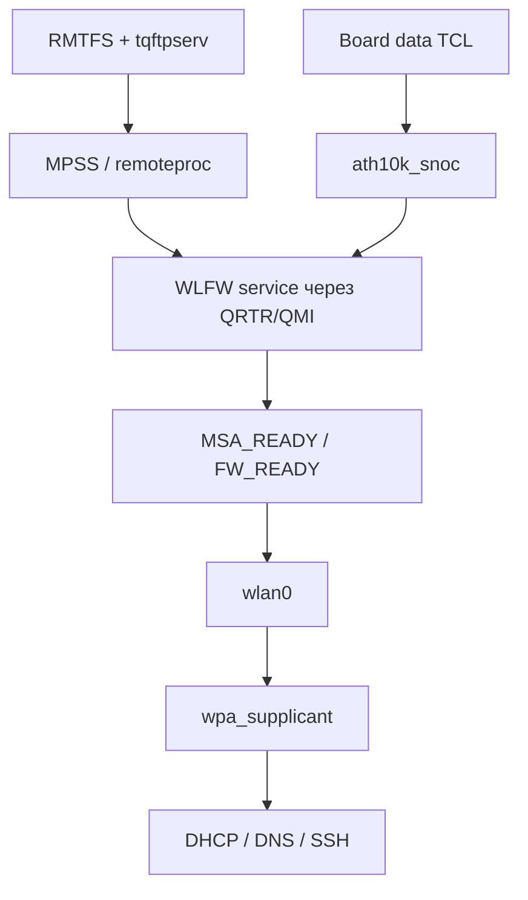

# Wi-Fi: WCN3990 / ath10k SNOC

Встроенный WLAN использует Qualcomm WCN3990 через SNOC и драйвер `ath10k_snoc`. Поддержка проверена при DT-загрузке Linux 6.18.34; ACPI-путь пока не подтверждён.

## Подтверждённые возможности

| Возможность | Подтверждение | Граница вывода |
|---|---|---|
| Подключение WLAN | WPA2-PSK/CCMP, DHCP, DNS, SSH; двусторонняя передача 4 MiB с совпадением SHA256 | Не является длительным стресс-тестом |
| Автоматический старт | После перезагрузки, включая Ubuntu с модифицированным ядром; без USB-сети телефона | Требует переноса firmware, служб и профиля в каждый новый образ |
| Диапазон 5 ГГц | Соединение на 5220 МГц, канал 44 | Не подтверждает все каналы и regulatory domains |
| Радиорежим | Наблюдались VHT, ширина 80 МГц, NSS2; RX PHY rate 390 и 520 Mbit/s | PHY rate не равен полезной скорости TCP или чтения диска |
| Переход между точками | Команда `wpa_cli roam` сохранила существующее SSH/TCP-соединение | Автоматический roaming, 802.11r и гарантированное время перехода не проверены |
| Предпочтение 5 ГГц | Профиль с priority=10 и freq_list; fallback priority=0; выбор 5220 МГц подтверждён после загрузки | Это политика выбора сети, не жёсткая привязка BSSID |

Длительная устойчивость, энергопотребление WLAN и поведение при suspend/resume требуют отдельной проверки. Поддержка Bluetooth не следует из наличия WCN3990: подключение Bluetooth на ноутбуке пока не установлено.

## Ресурсы DT

Источник — [полный реестр рабочего DT](full-inventory.md), узел `/soc@0/wifi@18800000`.

| Ресурс | Значение |
|---|---|
| compatible | `qcom,wcn3990-wifi` |
| MMIO membase | `0x18800000`, размер `0x800000` (8 MiB) |
| IRQ | GIC SPI 414–425, level-high; INTID 446–457 |
| IOMMU | Apps SMMU `0x15000000`, ячейки specifier `0xc0, 0x1` |
| MSA reserved memory | `0x93900000`, размер `0x200000` (2 MiB), `no-map` |
| Memory permissions | `qcom,msa-fixed-perm` присутствует |

OEM ACPI `AMSS.QWLN` также описывает MMIO `0x18800000/0x800000` и MSA `0x93900000/0x200000`. Совпадение ресурсов не означает готовность ACPI-драйвера. [IORT mapping](../../research/acpi-audit/iort-mappings/README.md) для `AMSS.QWLN` требует отдельного учёта input ID.

## Питание

Пути регуляторов ниже относительны к `/soc@0/rsc@18200000/`. Это **ограничения регуляторов в DT**, а не измеренные напряжения на плате. Название supply не заменяет числовые min/max.

| Supply Wi-Fi | Регулятор | min/max в DT |
|---|---|---|
| `vdd-0.8-cx-mx` | `regulators-0/ldo9` | 664000 / 664000 µV |
| `vdd-1.8-xo` | `regulators-1/ldo1` | 1800000 / 1800000 µV |
| `vdd-1.3-rfa` | `regulators-1/ldo2` | 1304000 / 1304000 µV |
| `vdd-3.3-ch0` | `regulators-1/ldo10` | 3304000 / 3304000 µV |
| `vdd-3.3-ch1` | `regulators-1/ldo11` | Числовые min/max отсутствуют |

Для всех пяти регуляторов задан `regulator-initial-mode = 3`. Физическая разводка и соответствие голосов питания OEM PEP требуют отдельной сверки; таблица фиксирует рабочее программное описание.

## Firmware и интерфейсы управления

По исходникам ath10k: probe создаёт QMI-клиента и подписку WLFW. Затем выполняются обмен capabilities, настройка MSA и передача board data. `FW_READY` приводит к регистрации ath10k. Успех probe сам по себе не подтверждает готовность интерфейса.

Board data передаёт ядро через QMI BDF download. tqftpserv обслуживает отдельные запросы DSP поверх QRTR. Отсутствие TFTP-запроса board-файла не доказывает, что board data не загружены.

| Файл / группа | Происхождение и применимость |
|---|---|
| `qcmpss7180_nm.mbn` | OEM TCL, MPSS используемой конфигурации |
| `wlanmdsp.mbn` | OEM TCL, firmware WLAN DSP; модель WCN3990 сама по себе не обосновывает замену файлом другой SoC |
| `bdwlan*`, `bdwlanu*` | Набор вариантов OEM TCL; наличие варианта не доказывает, что firmware выбрала именно его |
| `ath10k/WCN3990/hw1.0/board.bin` | Копия OEM bdwlan.bin в проверенном комплекте; контрольная сумма `e937bf4779ea30d588c3c9dab82913cd9e7fd31faaa45bde76b9fca876c0ad3c` |
| `ath10k/WCN3990/hw1.0/firmware-5.bin` | API-файл; контрольная сумма `fef6539e0127579536bc977be57a90d018b83f2931fedc3a8870fbe38d6c4127` |
| regulatory.db / подпись | Регуляторная база; допустимые частоты определяются её применением и режимом устройства |

[Контрольные суммы 16 OEM-файлов](../../research/peripherals/wifi-services/firmware-sha256.txt) идентифицируют сохранённый набор, а не список обязательной загрузки каждого варианта. На работающем TCL прочитаны QMI board_id=0xff и chip_id=0x320, оба DT calibration variant отсутствуют. [Сопоставление Ubuntu board-2 с алгоритмом ath10k](../../research/firmware-upstream/ubuntu-board-selection.md) выбирает generic запись board-id=ff с payload, совпадающим с текущим board.bin. Это проверка по коду и файлу; фактическая загрузка нового API2-контейнера не испытана. ID и variant другой платы нельзя считать идентификаторами TCL.

## Пользовательское окружение

Ubuntu использует systemd-networkd, wpa_supplicant, rmtfs, tqftpserv и nameserver QRTR ядра. [Порядок запуска и права конфигураций](../ubuntu.md#firmware-и-запуск-wi-fi).

MAC в исходном образце локально администрируемый; это не установленный заводской адрес и не значение для тиражирования. SSID, ключи и MAC задаются для конкретной установки. Скрипт [prefer-5ghz.py](../../research/peripherals/ubuntu-base/prefer-5ghz.py) иллюстрирует два профиля, но содержит фиксированный SSID и требует адаптации; он не доказывает поддержку 802.11r.

## Диагностические критерии

1. MPSS запущен; QRTR/WLFW доступен, ath10k создал phy и WLAN-интерфейс.
2. wpa_supplicant завершил ассоциацию; `iw dev wlan0 link` показывает частоту и состояние радиолинка.
3. DHCP выдал адрес и маршрут, DNS работает; доступ проверен без вспомогательной USB-сети.
4. Полезная пропускная способность измеряется передачей данных отдельно от PHY rate; для оценки roaming измеряется разрыв трафика и сохранность соединений.

Снимок QRTR показывает состояние на момент чтения; отсутствие службы в нём не исключает её кратковременного появления. Перезапуск MPSS и смена питания не являются операциями только чтения.
